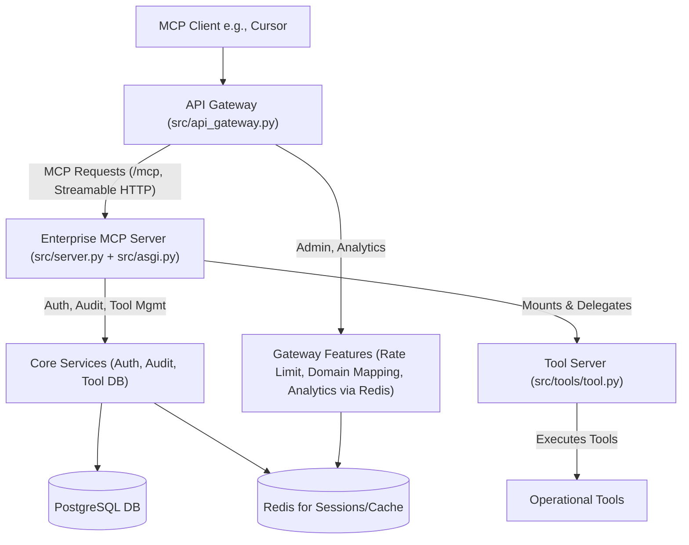

# MCP API Gateway and Services Ecosystem

[](LICENSE)

A comprehensive Model Context Protocol (MCP) solution featuring an API Gateway for routing and management, an Enterprise MCP Server for core services like authentication and tool administration, and a dedicated Tool Server for operational tool execution. Built with FastAPI and FastMCP.

## Overview

This project provides a multi-component system for dynamic registration and execution of tools via the Model Context Protocol (MCP), designed for robust and scalable integration with clients like Cursor.

The core components are:
1.  **API Gateway**: The primary entry point for all client requests. It handles routing to appropriate backend services, rate limiting, analytics, and domain-based configuration.
2.  **Enterprise MCP Server**: A backend service responsible for user authentication, authorization, audit logging, tool definition management (CRUD), and tool versioning. It mounts the Tool Server.
3.  **Tool Server**: A dedicated FastMCP instance where actual operational tools are defined and executed.

This architecture allows for separation of concerns, enhanced security, and better scalability.

`examples/` holds standalone example applications (e.g. `examples/ticketing_api.py`); they are not part of the MCP server and are not run by the Docker image.

## Architecture Diagram



## Features

**API Gateway (`src/api_gateway.py`):**
- **Advanced Routing**: Dynamically routes requests to backend services based on domain and path.
- **Rate Limiting**: Redis-backed rate limiting per domain/client.
- **Request Analytics**: Captures and provides analytics on API usage (via Redis).
- **Domain Mapping Management**: Allows configuration of routing rules, rate limits, and other settings per domain.
- **Backend Health Checks**: Monitors the health of backend services.
- **CORS Handling**: Configurable Cross-Origin Resource Sharing.

**Enterprise MCP Server (`src/server.py`, `src/asgi.py`):**
- **Authentication & Authorization**: Keycloak-validated bearer tokens (`client_credentials`) and role-based access control.
- **Audit Logging**: Comprehensive logging of significant events and tool interactions to a PostgreSQL database.
- **Tool Definition Management**: API endpoints for creating, reading, updating, and deleting tool definitions in the database.
- **Tool Versioning**: Support for managing different versions of tools.
- **Mounts Tool Server**: Integrates the operational Tool Server.
- **API Compatibility**: Provides an MCP-compliant Streamable HTTP endpoint (`/mcp`) for client interaction, delegating tool execution to the mounted Tool Server.

**Tool Server (`src/tools/tool.py`):**
- **Dedicated Tool Environment**: Isolated FastMCP instance for defining and executing operational tools.
- **Dynamic Tool Registration**: Tools can be added and become immediately available.

**Claude Code Integration (`src/tools/claude.py`, `src/tools/claude_auth.py`):**
- **Claude Code CLI**: Direct integration with `@anthropic-ai/claude-code` for advanced coding assistance.
- **Browser-Based Authentication**: OAuth flow support for secure Claude authentication.
- **Persistent Authentication**: Credentials stored in Docker volumes for convenience.
- **Error Handling**: Comprehensive error reporting and recovery suggestions.

**General:**
- **Fully API Compatible**: Designed for seamless integration with MCP clients like Cursor.
- **Dockerized**: Includes Docker and Docker Compose configurations for easy deployment of all components.

## Setup and Installation

### Prerequisites

- Docker and Docker Compose
- Python 3.12 or 3.13 (for local development — `pyproject.toml` requires `>=3.12,<3.14`)
- Node.js 20+ and npm (for Claude Code CLI)
- An environment file (`.env`) based on `.env.example`

### Environment Setup

1.  **Copy Example Environment File**:
    ```bash
    cp .env.example .env
    ```
2.  **Edit `.env`**: Update placeholder values. **`.env.example` is the source of truth for
    what belongs in `.env`** — it carries the secrets and per-deployment endpoints, and every
    entry there ships with a placeholder you are expected to replace. Broadly, it covers:
    *   Database credentials (`POSTGRES_PASSWORD_ENTERPRISE_MCP`, `POSTGRES_HOST`, and the
        PgBouncer / SSL settings used to build the connection string).
    *   Keycloak OAuth2 settings (`SERVICE_CLIENT_ID`, `SERVICE_CLIENT_SECRET`, `KEYCLOAK_URL`,
        `KEYCLOAK_REALM`).
    *   `JWT_SECRET_KEY` for token signing, and the admin bootstrap credentials.
    *   `ANTHROPIC_API_KEY` for the Claude Code integration.

    Non-secret configuration is **not** kept in `.env` — it is set in `docker-compose.yml`
    under the `mcp` service's `environment:` block. That is where `PORT`, `MCP_TRANSPORT`,
    `MCP_SERVER_NAME`, `REDIS_URL`, `CORS_ALLOWED_ORIGINS`, `DEFAULT_RATE_LIMIT`,
    `GATEWAY_HOST`/`GATEWAY_PORT`, `JWT_ALGORITHM` and
    `JWT_ACCESS_TOKEN_EXPIRE_MINUTES` live. Override them there rather than adding them to
    `.env`.

    The database credentials in `.env` must match those used by the `db` service in
    `docker-compose.override.yml`.

### Quick Setup with Claude Integration

For a complete setup including Claude Code CLI integration:

```bash
# Run the automated setup script
./scripts/setup_claude_integration.sh
```

This script will:
- Validate prerequisites
- Create environment file from template  
- Build Docker images with Claude CLI
- Start all services
- Guide you through Claude authentication

### Manual Setup

#### Running with Docker Compose (Recommended)

1.  **Build the Images**:
    ```bash
    docker compose build
    ```
2.  **Start the Services**:
    ```bash
    docker compose up -d
    ```
    This will start:
    *   `mcp` service — the Enterprise MCP Server (which mounts the Tool Server).
    *   `db` service — PostgreSQL, defined in `docker-compose.override.yml`.
    *   `redis` service.

3.  **Accessing the Services**:

    The compose stack publishes a single port, **`8030`**, on the `mcp` service. The API
    Gateway (`src/api_gateway.py`) is part of the codebase but is not run as its own
    container by `docker-compose.yml`, so there is no separate gateway port to connect to
    out of the box.

    *   **Enterprise MCP Server**: `http://localhost:8030`
        *   API Docs (Swagger UI): `http://localhost:8030/docs`
        *   Health: `http://localhost:8030/api/health`
    *   MCP Endpoint (Streamable HTTP): `http://localhost:8030/mcp`

4.  **Stopping the Services**:
    ```bash
    docker compose down
    ```

### Local Development (Without Docker)

1.  **Install Dependencies** (requires [uv](https://docs.astral.sh/uv/)):
    ```bash
    uv sync
    ```
    `pyproject.toml` and `uv.lock` are the authoritative — and only — dependency set. They
    are what the Docker image and CI install from.
2.  **Set Environment Variables**: Ensure all variables from `.env` are set in your shell. You'll need running PostgreSQL and Redis instances accessible.
3.  **Run the API Gateway**:
    ```bash
    python -m src.api_gateway # Or however it's packaged, e.g., uvicorn src.api_gateway:app --host <GATEWAY_HOST> --port <GATEWAY_PORT>
    ```
4.  **Run the Enterprise MCP Server**:
    ```bash
    python -m src.server # Or uvicorn src.asgi:app --host <ENTERPRISE_MCP_SERVER_HOST> --port <ENTERPRISE_MCP_PORT>
    ```

## Usage

### API Endpoints

Refer to the Swagger UI documentation for each service:
-   **API Gateway Docs**: `http://<GATEWAY_HOST>:<GATEWAY_PORT>/docs`
    -   Includes gateway admin endpoints (`/api/admin/domains`, `/api/admin/analytics/*`) and the main proxy route (`/{path:path}`).
-   **Enterprise MCP Server Docs**: `http://<ENTERPRISE_MCP_SERVER_HOST>:<ENTERPRISE_MCP_PORT>/docs` (if directly accessible, or viewable through its codebase for understanding).
    -   Key endpoints (typically accessed via the Gateway):
        -   `/auth/*`: Authentication and user management.
        -   `/audit/*`: Audit log access.
        -   `/tools/*`: Tool definition management (CRUD).
        -   `/tool-versions/*`: Tool version management.
        -   `/mcp`: Core MCP communication endpoint (Streamable HTTP transport).

    The containerised server (`src.asgi:app`, what the `Dockerfile` runs) does **not** mint
    tokens — it only validates them, via `KeycloakAuthMiddleware` (`src/keycloak_auth/`).
    Tokens come from Keycloak itself; see [Authentication Flow](#authentication-flow) below.
    A separate `POST /token` endpoint does exist in `src/api.py`, but that is a standalone
    REST admin server with its own `__main__` entry point — it is not mounted by `src.asgi`
    and is not part of the Docker image's request path.

### MCP Client Configuration (e.g., `~/.cursor/mcp.json`)

Configure your MCP client (like Cursor) to connect to the **API Gateway**:

```json
"MCP_API_Gateway": { // Use a descriptive name
    "url": "http://localhost:8030/mcp", // Streamable HTTP endpoint
    "debug": true,
    "retry_timeout_ms": 600,
    "connection_timeout_ms": 6000,
    "blocking_mode": false,
    "stream_mode": true,
    "message_format": "jsonrpc",
    "jsonrpc_version": "2.0",
    "auth": {
        "enabled": true,
        // Tokens are issued by Keycloak, not by the MCP server. Build this URL from the
        // KEYCLOAK_URL and KEYCLOAK_REALM values in your .env.
        "token_url": "http://localhost:8080/realms/master/protocol/openid-connect/token",
        "grant_type": "client_credentials",
        "client_id": "enterprise-mcp-server",  // SERVICE_CLIENT_ID from .env
        "client_secret": "your_client_secret", // SERVICE_CLIENT_SECRET from .env
        "content_type": "application/x-www-form-urlencoded",
        "token_property": "access_token",
        "auth_header": "Bearer"
    }
}
```
**Note on Token URL**: The `token_url` is a **Keycloak** endpoint, not an MCP Server or Gateway path — neither the Gateway nor the containerised Enterprise MCP Server issues tokens. Point it at `<KEYCLOAK_URL>/realms/<KEYCLOAK_REALM>/protocol/openid-connect/token` using the values you set in `.env`.

### Authentication Flow

1.  The MCP Client requests an access token directly from Keycloak's token endpoint.
    -   Uses `client_credentials` grant type with `SERVICE_CLIENT_ID` and `SERVICE_CLIENT_SECRET` (defined in `.env`; `KEYCLOAK_URL` and `KEYCLOAK_REALM` select the realm).
2.  Keycloak validates the credentials and returns an `access_token` (a JWT).
3.  The MCP Client includes this `access_token` in the `Authorization: Bearer <token>` header for all subsequent MCP requests (`/mcp`) to the API Gateway.
4.  The API Gateway forwards the request (with the token) to the Enterprise MCP Server.
5.  The Enterprise MCP Server validates the token against Keycloak (`KeycloakAuthMiddleware`) before processing the request or delegating to the Tool Server. Exempt from authentication are `/`, `/health`, `/docs`, `/redoc` and `/openapi.json`, plus anything under the `/docs`, `/redoc`, `/static` and `/openapi.json` prefixes (`_is_excluded_path`).

## Database Schema

The server uses a PostgreSQL database to store tool definitions, user information, roles, permissions, and audit logs.

See [docs/database_schema.sql](docs/database_schema.sql) for the detailed table structure.

## Contributing

Contributions are welcome — see [`CONTRIBUTING.md`](CONTRIBUTING.md) for dev setup, tests,
and the PR workflow. By participating you agree to the [Code of Conduct](CODE_OF_CONDUCT.md).
Found a security issue? Please follow the process in [`SECURITY.md`](SECURITY.md) — do not
open a public issue.

## License

Apache 2.0 — see [`LICENSE`](LICENSE) and [`NOTICE`](NOTICE).
